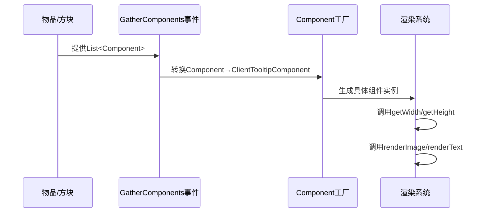

# 自定义Tooltip

在mod开发途中，为了使自己的mod更具风格化，更有特色，有时会需要自定义工具提示栏（Tooltip），本篇将会围绕几个实例，讲解neoforge1.21.1自定义Tooltip，希望能对你有所帮助

‍

# neoforge的Tooltip事件

在 NeoForge 1.21.1 中，处理工具提示(Tooltip)主要涉及三个核心事件，它们分别在工具提示生命周期的不同阶段触发。下面我将详细介绍这三个事件及其典型用法：

**客户端限定**：这些事件都应注册在 `Dist.CLIENT`​ 端

## 1. `RenderTooltipEvent.GatherComponents`​

**触发时机**：当游戏收集工具提示组件时（在渲染之前）

**主要用途**：

* 添加、移除或修改工具提示内容
* 插入自定义组件（如进度条、图标等）
* 根据条件动态改变工具提示

‍

## 2. `RenderTooltipEvent.Pre`​

**触发时机**：在工具提示即将渲染前

**主要用途**：

* 完全接管工具提示渲染
* 修改工具提示的位置、大小
* 添加自定义背景或边框

‍

## 3. `RenderTooltipEvent.Color`​

**触发时机**：当游戏确定工具提示颜色时

**主要用途**：

* 修改工具提示的背景和边框颜色
* 实现动态颜色效果
* 根据条件改变工具提示外观

‍

有了这几个事件，就可以方便的进行基础修改，比如改变物品提示栏的边框和背景颜色

```java
    @SubscribeEvent(priority = EventPriority.LOWEST)
    @OnlyIn(Dist.CLIENT)
    public static void colorTooltip(RenderTooltipEvent.Color event) {
		event.setBorderStart(0);
        event.setBorderEnd(0);
        event.setBackgroundStart(0);
        event.setBackgroundEnd(0);
    }
```

像这样，我们就将Tooltip的背景和边框变成了透明

同理，我们可以查看另外三个事件的方法，进行我们的自定义修改

‍

# 更进一步

往往开发者们想要更高级的自定义效果，如将边框背景渲染成图片，这又该如何实现呢？可能大家很快就能想到刚才所讲的几个事件，只要将图片渲染到Tooltip的位置就行了，但是物品提示框是动态变化，如何让一个图片就能适应所有的布局呢？

其实我们只需要用[9-Slice 渲染](9-Slice%20渲染.md)渲染就可以了，它可以帮我们自适应边框。

现在，我们已经接近了动态边框的问题，但是，我们还有一个重要问题没有解决，就是获取Tooltip的宽度和高度，所有的事件都没有get的方法，只有获取x，y坐标，这该怎么办呢？

在高版本中`ClientTooltipComponent`​ 是控制工具提示(Tooltip)内容呈现的核心类。相比旧版本直接渲染文本的方式，它提供了更强大、更灵活的组件化工具提示系统。我们可以通过它来获取宽和高，至于有关`ClientTooltipComponent`​的内容，请看这篇文章[关于ClientTooltipComponent](类/关于ClientTooltipComponent.md)

首先，在任意事件处，我们都可以通过`getComponents()`​来获取`List<ClientTooltipComponent>`​，

这是minecraft渲染tooltip的核心,逻辑如下



‍

我们可以通过判断List中最大`ClientTooltipComponent`​来获取长和宽

```java
    public static int calculateTooltipWidth(List<ClientTooltipComponent> tooltips) {
        int maxWidth = 0;

        for (ClientTooltipComponent component : tooltips) {
            int componentWidth = component.getWidth(Minecraft.getInstance().font);
            if (componentWidth > maxWidth) {
                maxWidth = componentWidth;
            }
        }

        // 添加 padding（通常左右各4像素）
        return maxWidth + 8;
    }
```

```java
    public static int calculateTextTooltipHeight( List<ClientTooltipComponent> tooltipLines) {
        // 每行高度（字体高度 + 行间距）
        int lineHeight = Minecraft.getInstance().font.lineHeight + 2; // 通常有2像素的行间距

        // 总高度 = 行数 × 每行高度 + 上下padding（通常各4像素）
        return tooltipLines.size() * lineHeight + 8;
    }
```

好了，作者的文笔很差，请见谅，更多更详细的内容，可以关注作者的b站，查看视频讲解
